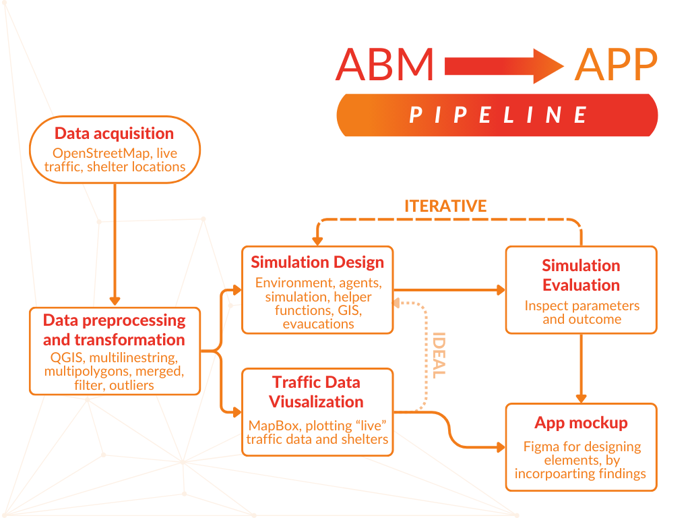

<p align="center">
    
  </p>

<h3 align="center">From Panic to Plan: Agent-Based Evacuation Simulations</h3>

<p align="center">
  Emilie Munch Andreasen (<strong><a href="https://github.com/EmilieAndreasen">@EmilieAndreasen</a></strong>),
  Katrine Munkholm Hygebjerg-Hansen (<strong><a href="https://github.com/katrinemunkholm">@KatrineMunkholm</a></strong>), and
    Sabrina Schroll Zaki Hansen (<strong><a href="https://github.com/sabszh">@Sabszh</a></strong>)
</p>

<p align="center">
  Spatial Analytics | Cultural Data Science <br>
  Aarhus University (June 2024) 
</p>

<hr>

This repository contains all the necessary components to run the Agent-Based Model (ABM) for evacuation in Aarhus along with  visualising traffic and movement data in Aarhus, the results of which are used to inform the [mock-up](https://www.figma.com/design/ZzUPYJiE9yhHM93OycdNY5/Spatial-Analytics%3A-Exam-application-design?node-id=0-1) of the “klar | parat” app.  

<p align="center">
    
  </p>


Key elements in this repository include:  
- **NetLogo Code/Model:** The core ABM evacuation model developed in NetLogo 6.4.0.  
- **Data (Shapefiles, CSVs):** Geographic data used within the NetLogo model, processed and formatted as shapefiles, CSV files with traffic data, and original unprocessed data.  
- **Python Preprocessing Scripts:** Script for preprocessing the initial raw data to generate the required shelter shapefile for the NetLogo model.  
- **Traffic Analysis and Plotting Scripts:** Python script for plotting traffic and evacuation shelter data in Aarhus, providing visual insights into traffic patterns near shelters.  

To re-run any of the above, please refer to the different relevant sub-sections under *Steps for Re-running*. For further information regarding the project or its reproducibility, contact the authors (see *Authors*).
<br>

## Project Structure 
The repository is structured as such:
| <div style="width:120px"></div>| Description |
|---------|:-----------|
| ```data``` | Folder with original un-processed raw data (see [data/README.md](https://github.com/EmilieAndreasen/cds-spatial-exam/blob/main/data/README.md)).      |
| ```images```  | Folder with logo image and plots used in the paper. |
| ```netlogo```  | Folder with all relevant data and NetLogo model (see [netlogo/README.md](https://github.com/EmilieAndreasen/cds-spatial-exam/blob/main/netlogo/README.md))          |
| ```scripts```  | Folder with Python script and Jupyter notebook used for preprocessing data and plotting (see [script/README.md](https://github.com/EmilieAndreasen/cds-spatial-exam/blob/main/scripts/README.md)).       |

<br>

## Steps for Re-running
### Getting Started 
**1. Clone/Download and Prepare the Repository:**  
If the attachment has not already been cloned or downloaded and unzipped, then start by cloning or downloading the zip file and unzip it in your desired location. 

### Instructions (NetLogo Model)
**2. Prerequisites:**  
Ensure you have NetLogo 6.4.0 installed to run the model. Attempting to open or run the model with another version can result in functionalities being lost.  

**3. Setup and Run Model:**  
Below are the steps to follow for running the model to simulate evacuation in part of Aarhus.  

**Set desired parameters for the model**  
On the left side of the model's interface certain variables can be set and changed. Alternatively, you can also click on *Initialize* to set the variables to the default ones. The variables that can be changed from the interface are:  

- *Immediate evacuation:* If turned to on, agents start evacuation right away. If turned to being off - the default - agents start with a delay determined by a Rayleigh distribution and which 'decision' they are allocated (i.e., either quick milling time or slow milling time).  
- *Ped_Speed and Ped_Sigma:* Parameters for the normal distribution used to draw the walking speed of the evacuees. Setting these to 0.01 and 0.005 respectively simulates a range of walking speeds.
- *Rtau1_short:* The time constant for shorter milling times (5 minutes in seconds).  
- *Rtau2_long:* The time constant for longer milling times (10 minutes in seconds).  
- *Rsig1_short:* The sigma value for the variation in shorter milling times.  
- *Rsig2_long:* The sigma value for the variation in longer milling times.  

**Click on *READ(1/2)***  
You MUST click on this, and reload the model every time you change the parameters on the left panel. This step loads the GIS files, sets up the initial world envelope, and prepares the road network and shelters.

- *Read GIS files:* Loads the coordinate system and datasets for shelters and road network.  
- *Read obstacle data:* Loads and marks obstacles on the map as black patches.  
- *Load network:* Sets up the road network by creating intersections and roads based on the GIS data.  
- *Load shelters:* Creates shelter locations on the map and stores their coordinates.  

**Click on *READ 2/2***  
Following *READ(1/2)*, you must click this. *READ(2/2)* loads the population and assigns them to locations on the map near the road network, preparing them for evacuation.  

- *Load population:* Creates residents, assigns them speeds, and determines their nearest shelter and evacuation decisions.

**Click on *GO***  
This final button will run the simulation. Residents will start moving towards their assigned shelters based on their milling time and speeds. The simulation will track their evacuation status and mortality rate.  

- *Residents' movement:* Residents move towards shelters if they are not dead and their milling time has elapsed. If they reach a shelter, they are marked as evacuated; if they exceed the maximum evacuation time, they are marked as dead.  
- *Update mortality rate:* Calculates the mortality rate based on the number of dead residents.

### Instructions (Python Script)
**2. Set Up the Virtual Environment:**  
Execute the following command in your terminal to set up the Python virtual environment and install the needed dependencies.
```
bash setup.sh 
```

**3. Activate the Virtual Environment and Run the Code:**  
Activate the virtual environment and run the Python script in the scripts folder to preprocess the original raw 'shelters23.geojson' data. 
```
source env/bin/activate
python script
```


### Instructions (Python Notebook)
**2. Set Up the Virtual Environment:**  
Execute the following command in your terminal to set up the Python virtual environment and install the needed dependencies.
```
bash setup.sh 
```

**3. Activate the Virtual Environment and Run the Code:**  
Activate the virtual environment and run the Jupyter Notebook as needed. Specifically, open the notebook file in the scripts folder to preprocess data and generate plot.
```
source env/bin/activate
jupyter notebook
```

<br>

## License
This project is licensed under the MIT License - see the [LICENSE](LICENSE.md) file for details.

## Authors 
This code repository was made as a joint effort by Emilie Munch Andreasen ([@EmilieAndreasen](https://github.com/EmilieAndreasen)), Katrine Munkholm Hygebjerg-Hansen ([@KatrineMunkhholm](https://github.com/katrinemunkholm)), and Sabrina Schroll Zaki Hansen ([@Sabszh](https://github.com/sabszh)). 

### Contact us
For any questions regarding the reproducibility or project in general, you can contact us:
<ul style="list-style-type: none;">
  <li><a href="mailto:202106384@post.au.dk">EmilieAndreasen@post.au.dk</a>
(Emilie)</li>
    <li><a href="mailto:202106444@post.au.dk"> KatrineMunkgolm@post.au.dk</a>
(Katrine)</li>
    <li><a href="mailto:202105174@post.au.dk"> SabrinaZakiHansen@post.au.dk</a>
(Sabrina)</li>
</ul>
